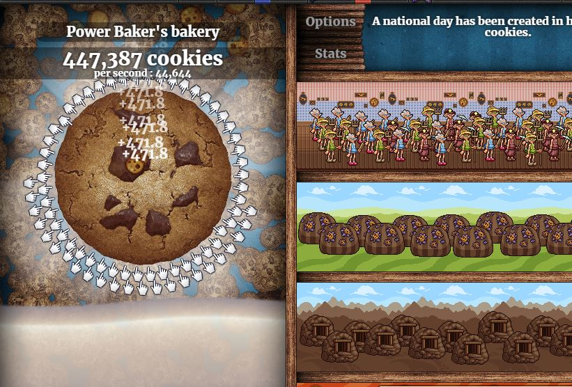

# selenium
This is a code along by Tech with Tim.  It's my first time learing selenium - which might be my new favourite technology.  This is a six part video series on YouTube, it goes from installation of Selenium to fairly complicated tasks.  You can find the course video's <a href="https://www.youtube.com/watch?v=Xjv1sY630Uc&list=PLzMcBGfZo4-n40rB1XaJ0ak1bemvlqumQ">here.</a>

